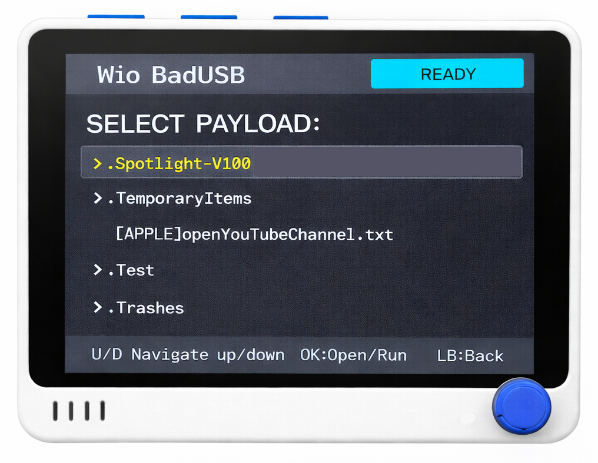

<p align="center">
  
</p>

<br>

<h1 align="center">Wio BadUSB</h1>

<p align="center">
  <b>BadUSB-style USB HID payload runner for the Seeed Studio Wio Terminal</b><br/>
  <sub>SD-card payloads • Rubber Ducky-like syntax • On-device UI • One-click run</sub>
</p>

<p align="center">
  <a href="https://github.com/GH0ST3CH/Wio_Terminal_BadUSB/releases"></a>
  <a href="https://github.com/GH0ST3CH/Wio_Terminal_BadUSB/blob/main/LICENSE"></a>
  <a href="https://github.com/GH0ST3CH/Wio_Terminal_BadUSB"></a>
  <a href="https://github.com/GH0ST3CH/Wio_Terminal_BadUSB/blob/main/WioBadUSB_syntax_guide.md"></a>
</p>

<p align="center">
  
</p>

---

## Overview

**Wio BadUSB** turns your **Wio Terminal** into a clean, standalone **USB HID payload runner**.  
Load your scripts on a microSD card, browse them on-device, and execute them with a single press.

Built for fast, repeatable workflows with a simple UI and a practical, Rubber Ducky-style HID command set.

---

## Highlights

- **SD-card payload library**: keep payloads organized in folders and run `.txt` scripts instantly
- **Rubber Ducky-like syntax**: `STRING`, `STRINGLN`, `DELAY`, `DEFAULTDELAY`, `REPEAT`, plus unlimited key chords
- **On-device UI**: browse directories, see status, and run payloads without a host-side app
- **Wide key support**: modifiers, navigation, function keys (F1–F24), and numpad keys

---

## Controls (Wio Terminal)

Displayed in the footer inside the firmware UI:

- **UP / DOWN**: Navigate
- **OK (5-way press)**: Open folder / Run payload
- **LB (Left bumper button / BTN_C)**: Back

---

## Payloads

Payloads are **plain text** files ending in `.txt`.  
Place them anywhere on the SD card (folders supported).

Example: `payloads/demo.txt`

```text
REM Demo payload
DEFAULTDELAY 120
GUI r
DELAY 500
STRING notepad
ENTER
DELAY 800
STRINGLN Hello from Wio BadUSB!
ALT F4
```

### Supported commands

- `REM <text>` — comment
- `STRING <text>` — type text
- `STRINGLN <text>` — type text, then press Enter
- `DELAY <ms>` — wait in milliseconds
- `DEFAULTDELAY <ms>` — set inter-command delay (alias: `DEFAULT_DELAY`)
- `REPEAT <n>` — repeat the previous command `n` times
- `<KEY> [KEY KEY ...]` — press all listed keys simultaneously (chord)

Full reference:  
https://github.com/GH0ST3CH/Wio_Terminal_BadUSB/blob/main/WioBadUSB_syntax_guide.md

---

## Quick start

### 1) Get the code

**Option A: Download ZIP**
- Open the repository on GitHub
- Click **Code → Download ZIP**
- Extract it

**Option B: Clone**
```bash
git clone https://github.com/GH0ST3CH/Wio_Terminal_BadUSB.git
cd Wio_Terminal_BadUSB
```

### 2) Install prerequisites & dependencies

#### Software prerequisites
- **Arduino IDE** (v1.8.x or v2.x): https://www.arduino.cc/en/software

#### Board support (Wio Terminal / Seeed SAMD)
Add this to **Arduino IDE → Preferences → Additional Boards Manager URLs**:
https://files.seeedstudio.com/arduino/package_seeeduino_boards_index.json

Then install via **Tools → Board → Boards Manager**:
- **Seeed SAMD Boards**

Select the board:
- **Tools → Board → Wio Terminal** (name may appear as “Seeed Wio Terminal”)

#### Libraries (required)
Install these using **Sketch → Include Library → Manage Libraries**:

- **TFT_eSPI** (display)
- **Seeed Arduino FS** (`Seeed_FS.h`)
- **Seeed Arduino SD** (`SD/Seeed_SD.h`)

> Notes for library names in Arduino IDE vary by publisher; if you search “Seeed FS” and “Seeed SD” you should see the Seeed-provided packages that provide `Seeed_FS.h` and `SD/Seeed_SD.h`.

#### Hardware prerequisites
- Wio Terminal
- USB-C **data** cable
- microSD card (FAT32)

---

## Build & upload (Arduino IDE)

1. Open `WioBadUSB.ino`
2. **Tools → Board**: select **Wio Terminal**
3. **Tools → Port**: select your Wio Terminal port
4. Click **Verify**, then **Upload**

After upload, the Wio Terminal reboots into **Wio BadUSB**.

---

## SD card setup (recommended structure)

Format microSD as **FAT32**, then create a simple structure like:

```text
/payloads
  /windows
    win_demo.txt
  /mac
    mac_demo.txt
demo.txt
```

Only files ending in `.txt` appear as runnable payloads in the UI.

---

## Contributing

- Ideas, fixes, and enhancements are welcome via Issues and Pull Requests.

---

## License

MIT — see `LICENSE`  
https://github.com/GH0ST3CH/Wio_Terminal_BadUSB/blob/main/LICENSE

---

## Support this project

If you appreciate this firmware, consider supporting ongoing development:

<p align="center">
  <a href="https://buymeacoffee.com/ghostech">
    
  </a>
</p>
